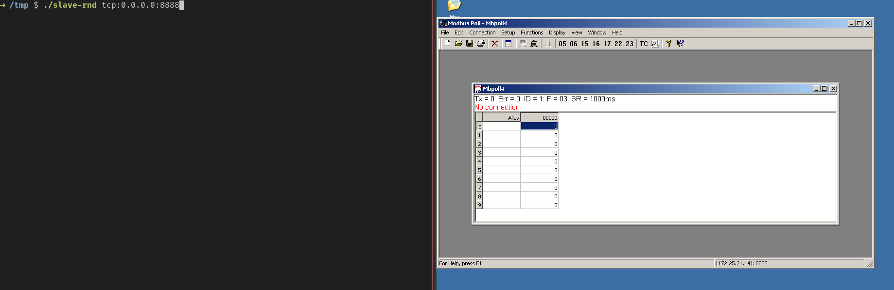
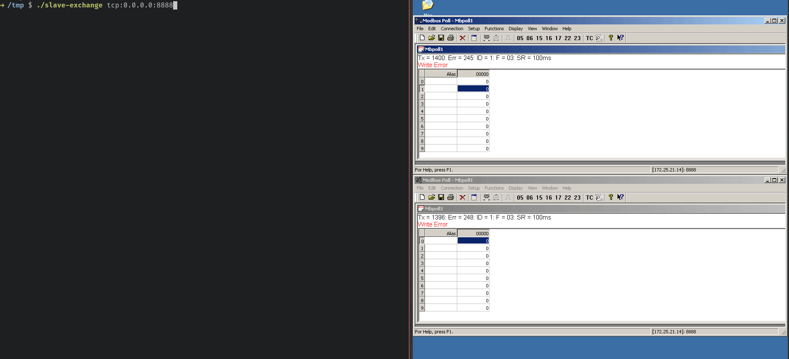

# Table of contents
* [About](#about)
* [Tools](#tools)
    * [slave-rnd](#tools-slave-rnd)
    * [slave-exchange](#tools-slave-exchange)
* [Implementation details](#implementation-details)
* [Cross compile](#cross-compile)
* [Online examples](#online-examples)

<a name="about"></a>
## About

[](https://gitlab.com/alexssh/modbus-tools/-/commits/master)
[](https://gitlab.com/alexssh/modbus-tools/-/commits/master)
[](https://opensource.org/licenses/MIT)
[](https://gitlab.com/alexssh/modbus-tools/-/releases)

Tools for working with Modbus protocol powered by Rust/Tokio. Apps are available
online. See [here](#online-examples) for details.

<a name="tools"></a>
## Tools

<a name="tools-slave-rnd"></a>
### slave-rnd

Slave emulator that generates random answers to read requests
and positively acknowledges on write commands. Useful for fast check of Modbus
masters like SCADA systems, custom client implementations, etc.



The easiest way is to build and run via Cargo. By default, Modbus TCP uses 502
port that, in most cases, requires root privileges. Therefore all examples are
presented on port 1502.

```
cargo run --bin slave-rnd tcp:0.0.0.0:1502
..
[2022-07-08T14:49:25Z INFO  slave_rnd] start server 0.0.0.0:1502
[2022-07-08T14:49:25Z INFO  slave_rnd] start message processor
[2022-07-08T14:49:25Z INFO  slave_rnd] press Ctrl+C to exit
[2022-07-08T14:49:27Z INFO  transport::tcp::server] 127.0.0.1:44544 connected
[2022-07-08T14:49:30Z INFO  transport::tcp::server] 127.0.0.1:44548 connected
```

Run with verbose output.

```
RUST_LOG=trace cargo run --bin slave-rnd tcp:0.0.0.0:1502
...
[2022-07-08T14:50:16Z INFO  slave_rnd] start server 0.0.0.0:1502
[2022-07-08T14:50:16Z INFO  slave_rnd] start message processor
[2022-07-08T14:50:16Z INFO  slave_rnd] press Ctrl+C to exit
[2022-07-08T14:50:16Z INFO  transport::tcp::server] 127.0.0.1:56896 connected
[2022-07-08T14:50:17Z DEBUG codec::net::default] 127.0.0.1:56896 unpack [0, 197, 0, 0, 0, 6, 1, 3, 0, 0, 0, 10]
[2022-07-08T14:50:17Z DEBUG transport::tcp::server] 127.0.0.1:56896 RequestFrame { id: Some(197), slave: 1, pdu: ReadHoldingRegisters { address: 0, nobjs: 10 } }
[2022-07-08T14:50:17Z DEBUG transport::tcp::server] 127.0.0.1:56896 ResponseFrame { id: Some(197), slave: 1, pdu: ReadHoldingRegisters { nobjs: 10, data: Data { buffer: [145, 4, 173, 2, 122, 70, 61, 128, 56, 198, 89, 37, 62, 72, 5, 186, 233, 123, 79, 21] } } }
[2022-07-08T14:50:17Z DEBUG codec::net::default] 127.0.0.1:56896 pack [0, 197, 0, 0, 0, 23, 1, 3, 20, 4, 145, 2, 173, 70, 122, 128, 61, 198, 56, 37, 89, 72, 62, 186, 5, 123, 233, 21, 79]
[2022-07-08T14:50:17Z DEBUG codec::net::default] 127.0.0.1:56896 unpack [0, 198, 0, 0, 0, 6, 1, 3, 0, 0, 0, 10]
..
```

Run in serial mode.

```
cargo run --bin slave-rnd serial:/dev/ttyUSB0:38400-8-N-1
```

<a name="tools-slave-exchange"></a>
### slave-exchange

A slave emulator allows connecting N masters. Some masters can write into
registers, and others can read. Typical usage is temporary storage for
connecting different components of a system.



Running:

```
cargo run --bin slave-exchange tcp:0.0.0.0:1502 udp:0.0.0.0:1502 serial:/dev/ttyUSB0:9600-8-N-1
..
[2022-12-07T19:43:18Z INFO  transport::builder] start tcp server 0.0.0.0:1502
[2022-12-07T19:43:18Z INFO  transport::builder] start udp server 0.0.0.0:1502
[2022-12-07T19:43:18Z INFO  transport::builder] start rtu slave /dev/ttyUSB0:9600-8-N-1
[2022-12-07T19:43:18Z INFO  slave_exchange] press Ctrl+C to exit
```

<a name="implementation-details"></a>
## Implementation details

Supported modes:

- [x] Slave
- [ ] Master

Supported transport: 

- [x] TCP
- [x] UDP
- [x] Serial

Supported functions: 

- [x] 0x01 Read Coils
- [x] 0x02 Read Discrete Inputs
- [x] 0x03 Read Holding Registers
- [x] 0x04 Read Input Registers
- [x] 0x05 Write Single Coil
- [x] 0x06 Write Single Register
- [ ] 0x07 Read Exception Status
- [ ] 0x08 Diagnostics
- [ ] 0x0B Get Comm Event Counter
- [ ] 0x0C Get Comm Event Log
- [x] 0x0F Write Multiple Coils
- [x] 0x10 Write Multiple registers
- [ ] 0x11 Report Slave ID
- [ ] 0x14 Read File Record
- [ ] 0x15 Write File Record
- [ ] 0x16 Mask Write Register
- [ ] 0x17 Read/Write Multiple registers
- [ ] 0x18 Read FIFO Queue
- [ ] 0x2B/0x0D Encapsulated Interface Transport
- [x] 0x2B/0x0E Encapsulated Interface Transport. Read Device Identification


<a name="cross-compile"></a>
## Cross-compile

#### ARMv7

ARMv7 binaries could be run, for example, on Raspperry PI (32 bit) or iMX6UL.

```
cargo build --target=armv7-unknown-linux-gnueabihf 
```

#### Windows 10

```
cargo build --release --target=x86_64-pc-windows-gnu
```

<a name="online-examples"></a>
## Online examples

slave-rnd - 173.212.202.137:502. TCP and UDP transport is enabled.

slave-exchange - 173.212.202.137:1502. TCP and UDP transport is enabled.

